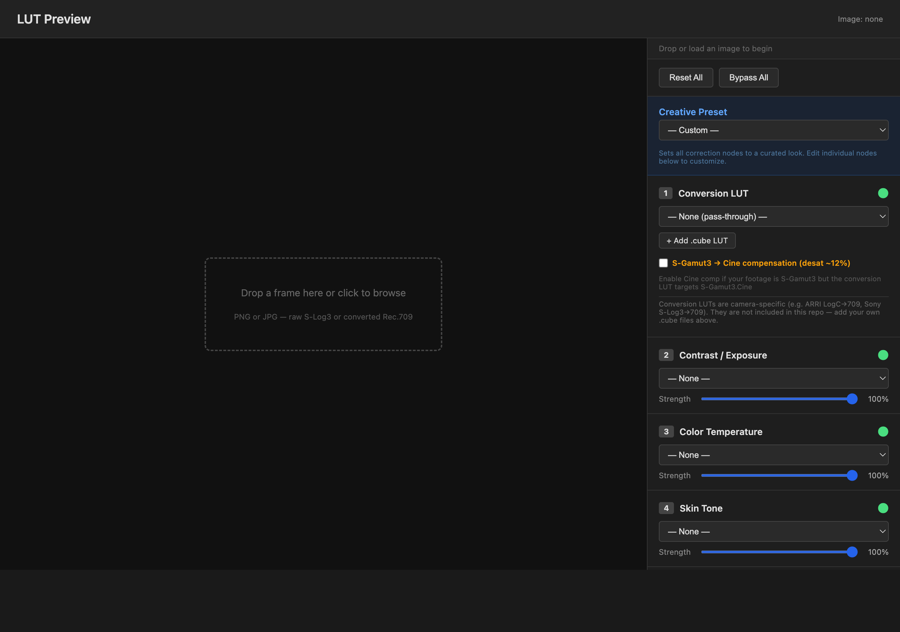

# color-grade-ai

Generate targeted .cube 3D LUTs for color correction using AI-assisted frame analysis. Works with **DaVinci Resolve** and **Adobe Premiere Pro**.

Built as a [Claude Code](https://claude.ai/claude-code) skill — Claude analyzes your footage, identifies color problems, and generates precise correction LUTs automatically.

[Documentation](https://isaacrowntree.github.io/color-grade-ai) | [Skill Reference](SKILL.md)

---

## What It Does

Feed it a video frame. It tells you what's wrong and generates a .cube LUT to fix it.

```bash
# Frame in, fitted correction LUT out
python3 auto_grade.py frame_709.png --emit fix.cube

# Fit against a whole clip rather than one arbitrary frame
python3 sample_clip.py clip.mov --emit fix.cube

# Auto-analyze a frame and get per-node recommendations
python3 auto_grade.py frame_709.png

# Generate a correction LUT
ruby generate_lut.rb red_skin_fix skin_fix.cube

# Bake a creative preset into a single LUT
ruby generate_chain_lut.rb studio_balanced.cube \
  studio_punch@0.8 warm_shift@0.3 sat_boost@0.5 black_crush@0.15
```

### Interactive Preview

Drag-and-drop a frame, load your conversion LUT, and dial in corrections across a 6-node chain — all in the browser.



`python3 -m http.server 8080` then open `http://localhost:8080/preview.html`

## Getting Started

### Requirements

- Ruby 2.7+
- Python 3 with [Pillow](https://pillow.readthedocs.io/) + NumPy
- [ffmpeg](https://ffmpeg.org/)

### Install

```bash
git clone https://github.com/isaacrowntree/color-grade-ai.git
cd color-grade-ai
pip3 install Pillow numpy
```

### Quick Example

```bash
# Extract a frame from your footage
ffmpeg -i your_video.mov -ss 00:00:30 -frames:v 1 frame.png

# Generate a LUT
ruby generate_lut.rb yellow_fix yellow_fix.cube

# Apply in ffmpeg
ffmpeg -i input.mp4 \
  -vf "lut3d='conversion.cube':interp=tetrahedral,lut3d='yellow_fix.cube':interp=tetrahedral" \
  output.mp4
```

**DaVinci Resolve:** Add a serial node → right-click → LUT → browse to .cube file.

**Adobe Premiere Pro:** Lumetri Color → Creative → Look dropdown → browse to .cube file.

See [SKILL.md](SKILL.md) for the full list of presets, node chain building blocks, creative presets, auto-grade workflow, and video export recipes.

## Use as a Claude Code Skill

```bash
# Project-level
git clone https://github.com/isaacrowntree/color-grade-ai.git .claude/skills/color-grade

# Personal-level (available everywhere)
git clone https://github.com/isaacrowntree/color-grade-ai.git ~/.claude/skills/color-grade
```

The repo also ships a plugin manifest at [`.claude-plugin/plugin.json`](.claude-plugin/plugin.json),
so it can be installed as a Claude Code plugin rather than cloned by hand.

Then just talk to Claude:

```
> The skin in my dance video looks sunburnt and red. Can you fix it?
> Analyze the frame at 30 seconds and tell me what corrections I need
> /color-grade red_skin_fix output.cube
```

## Just want the LUTs?

You don't need Ruby or Python. Every correction LUT is pre-baked in
[`correction_luts/`](correction_luts) — download the `.cube` file you need and drop it
straight into Resolve or Premiere.

## Documentation

The [docs site](https://isaacrowntree.github.io/color-grade-ai) is auto-generated from [SKILL.md](SKILL.md). To rebuild: `ruby generate_docs.rb && cd docs && npm run build`

## Tone model (v2)

Tone operations run in **linear light** rather than on gamma-encoded HSL
lightness, so they preserve hue and saturation instead of quietly shifting them.
Greys are unchanged from v1; saturated colours move. See
[Tone Model](SKILL.md#tone-model-v2) for the detail, and pass `--legacy` to any
generator to reproduce v1 output exactly.

## Development

Seven suites, no test framework to install:

```bash
ruby test_luts.rb            # preset pipelines, .cube output, golden-file regression
ruby test_color_model.rb     # linear-light tone model, chromaticity, legacy parity
ruby test_repo_hygiene.rb    # line endings, exec bits, manifests, CI wiring
python3 test_auto_grade.py   # frame analysis: white balance, skin, exposure
python3 test_lut_apply.py    # Python .cube engine, parity with the Ruby pipeline
python3 test_eval.py         # closed-loop grading against known defects
python3 test_sample_clip.py  # clip sampling, aggregation, scene-change detection
node --test test_pipeline.mjs  # browser pipeline parity with every shipped LUT
```

`test_eval.py` is the one that makes "the grader got better" measurable: it
applies known defects to a synthetic scene, grades them, and asserts how much of
each defect actually went away.

The shipped LUTs in `correction_luts/` are reproducible artifacts, generated from
`correction_luts/manifest.yml`:

```bash
ruby regenerate_luts.rb          # rebuild them all
ruby regenerate_luts.rb --check  # fail if what's committed has drifted
```

All three run in CI on every push and pull request.

`test_luts.rb` checksums every generated LUT against `reference_checksums.yml`, so any
change to the colour maths shows up as a failing test. If a change is intentional,
regenerate the baseline and review the diff:

```bash
ruby test_luts.rb --generate-reference
```

## Related Projects

- [ButterCut](https://github.com/barefootford/buttercut) — AI-powered video editing timelines for FCP, Premiere, and Resolve.

## License

MIT
